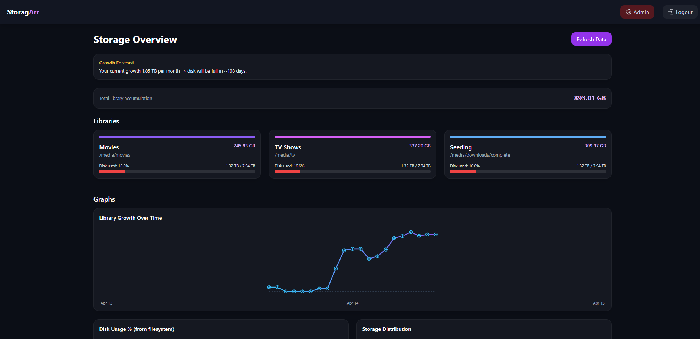
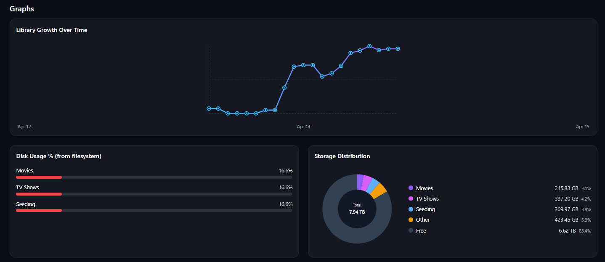
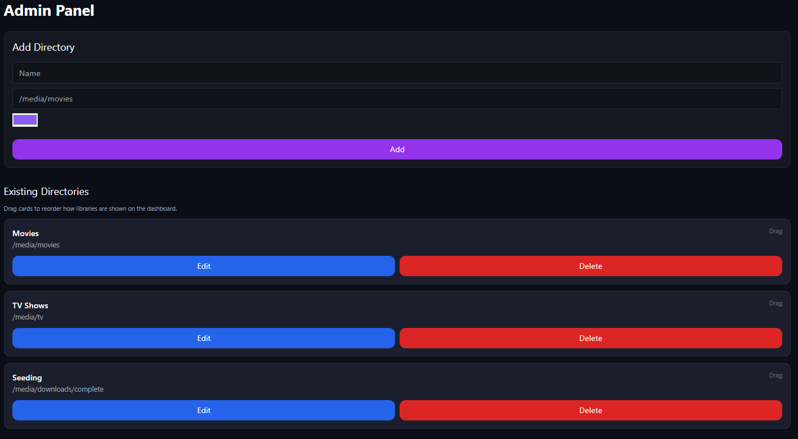

# Storagarr

Storagarr is a self-hosted storage observability app for media libraries.
It scans mounted directories, tracks usage over time, highlights growth trends, and helps spot duplicate/bloat folder sets.

> Yes, this project has been vibe coded and was created due to a quick personal need to have some better insight of how much storage was getting used.

## What It Does

- Scans configured library directories and calculates size per top-level folder.
- Tracks growth history and estimates monthly growth + time-to-full.
- Shows disk usage metrics (used/free/total) per filesystem.
- Detects likely duplicate movie folders ("bloat detection").
- Supports first-run admin bootstrap and authenticated admin actions.
- Watches directories for changes and rescans automatically.

## Preview





## Tech Stack

- Backend: Node.js + Fastify
- Frontend: React + Vite + Tailwind CSS
- Auth: JWT + bcrypt
- File watching: chokidar
- Storage: JSON files in mounted /config volume

## Project Structure

- frontend: React UI
- backend: Fastify API, scanning, watcher, auth
- config: local config files for split-compose usage
- docker-compose.dev.yml: local development stack
- docker-compose.yml: split backend/frontend image stack
- docker-compose.prod.yml: single container production deployment
- Dockerfile: single image build (backend + compiled frontend)

## Core Flows

### First run

1. App checks GET /api/auth/status.
2. If no admin exists, UI forces admin creation.
3. Admin logs in and receives a JWT token.

### Runtime

1. Backend loads saved directories from /config/directories.json.
2. Initial scan runs on startup.
3. Watchers listen for file/folder changes and trigger rescans.
4. UI reads public scan data and growth history.

## API Overview

### Auth

- GET /api/auth/status
- GET /api/auth/verify
- POST /api/auth/login
- POST /api/auth/create-admin

### Public

- GET /api/public/directories
- GET /api/public/growth-history
- GET /api/public/scan/:id?refresh=1

### Admin (JWT required)

- POST /api/admin/add-directory
- POST /api/admin/update-directory
- POST /api/admin/reorder-directories
- POST /api/admin/delete-directory
- GET /api/admin/scans

## Quick Run

```bash
docker run -d \
  --name storagarr \
  -p 8282:8282 \
  -e JWT_SECRET=replace_with_long_random_secret \\
  -v /config/storagarr:/config \
  -v /media:/media:ro \
  --restart unless-stopped \
  yarnes/storagarr:latest
```

Open http://localhost:8282

## Docker Compose Example

```yaml
services:
  storagarr:
    image: yarnes/storagarr:latest
    container_name: storagarr
    environment:
      - JWT_SECRET=${JWT_SECRET:-}
    ports:
      - "8282:8282"
    volumes:
      - /config/storagarr:/config
      - /media:/media:ro
    restart: unless-stopped
```

## Environment and Volumes

Storagarr stores runtime files in /config:

- users.json
- directories.json
- scans.json
- growth.json

Mount your media libraries read-only (recommended), for example /media.
Paths you add in the admin UI must exist inside the container.
If JWT_SECRET is omitted, Storagarr auto-generates one and stores it at /config/jwt-secret.txt.

## Configuration and Persistence

Storagarr writes runtime data to /config:

- users.json
- directories.json
- scans.json
- growth.json

In split/dev flows this maps to ./config in the repo.
In production flow it maps to /config/storagarr on host (as defined in compose).

Important:

- Directory paths added in the UI must exist inside the container.
- Mount your media path(s) into the container (example: /media).


## Security Notes

- Set JWT_SECRET in your Docker environment for explicit secret management.
- If JWT_SECRET is not set, Storagarr auto-generates a secret and persists it to /config/jwt-secret.txt.
- If /config is not writable, a temporary in-memory secret is used and all tokens reset on restart.
- Run behind reverse proxy + TLS for public access.
- Keep /config private and backed up.

## Roadmap Ideas

- Per-user roles and audit logs
- Scheduled scan windows and throttling
- Smarter duplicate detection and cleanup actions
- Notifications for threshold alerts

## License

No license file is currently present in this repository.
Add one before public/commercial reuse.
